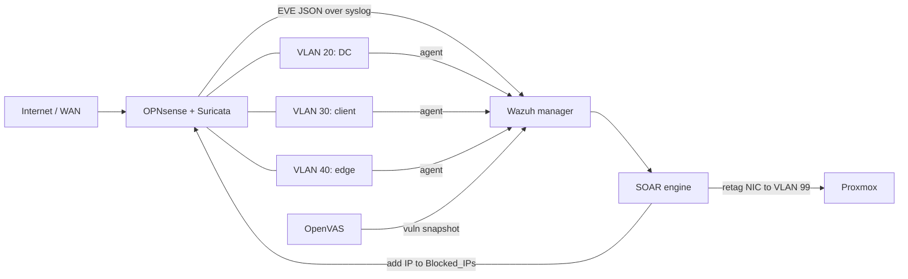

# xdr-soc-lab

[](https://github.com/piscu1/xdr-soc-lab/actions/workflows/ci.yml)
[](LICENSE)

An open-source XDR stack built on Proxmox, OPNsense, Suricata, Wazuh and OpenVAS. A small Python SOAR engine sits on top: it scores every alert and responds to it. It blocks the attacker's IP on the firewall, and if the score is high enough, it moves the victim VM into a quarantine VLAN.

In the thesis experiments it detected attacks in 2.3 s and responded in 2.2 s on average.

This is the code from my bachelor's thesis at the Faculty of Electronics, Telecommunications and Information Technology, POLITEHNICA University of Bucharest (2026), supervised by Conf. Dr. Ing. Dumitru-Iulian Năstac and As. Drd. Andrei Andronescu. The thesis title was "Design and Implementation of an Open-Source XDR Ecosystem with Advanced Automation and Incident Response Mechanisms".

## Two profiles

The same infrastructure can be deployed two ways:

| | Lab | Hardened |
|---|---|---|
| Playbooks | `ansible/playbooks/lab/` | `ansible/playbooks/hardened/` |
| Purpose | the thesis experiments, something to attack | something you can actually run |
| Firewall | "temporary" exceptions, vendor access from anywhere, flat internal access | default deny per zone, scoped egress, management only from the admin network |
| Targets | Juice Shop, DVWA, vulnerable Apache/MySQL/Postgres, legacy DC with SMBv1 | none, the DMZ host only runs the Wazuh agent |
| Details | [docs/lab-profile.md](docs/lab-profile.md) | [docs/hardened-profile.md](docs/hardened-profile.md) |

The detection and response stack (Suricata, Wazuh, OpenVAS, SOAR engine) is identical in both.

## Architecture

Everything runs as VMs on a single Proxmox host. OPNsense routes between all the VLANs, so every packet crossing a zone boundary passes through Suricata.

| VLAN | Subnet | Role | VMs |
|------|--------|------|-----|
| 10 | 10.0.10.0/24 | Security / management | OPNsense (100), Wazuh manager + SOAR (200), OpenVAS (300) |
| 20 | 10.0.20.0/24 | Core | Windows Server DC (500) |
| 30 | 10.0.30.0/24 | Users | Windows 10 client (600) |
| 40 | 10.0.40.0/24 | Edge / DMZ | Ubuntu with Docker (400) |
| 99 | none | Quarantine | whatever the SOAR engine isolates |



## How the response works

`soar-python/soar_engine.py` tails `/var/ossec/logs/alerts/alerts.json` on the Wazuh manager and scores each alert:

- the base score is the Wazuh rule level times 2
- extra points depend on which zone was hit (+40 core, +20 users, +10 edge)
- +30 for brute force or scan patterns, +40 for SQL injection, +50 for ransomware-like FIM activity (files being renamed to `.encrypted`)
- +80 if OpenVAS already found a matching vulnerability on the target (for example, a SQLi alert against a host OpenVAS flagged for CWE-89)
- lateral movement (an internal 10.0.x.x host showing up in alerts against 3 or more different hosts within 5 minutes) forces the score up to the isolation threshold

At 50 or more, the source IP is pushed into the `Blocked_IPs` alias on OPNsense through its API. At 80 or more, the engine also moves the victim VM's network interface to VLAN 99 on Proxmox. Every action is sent as a Telegram message with the score breakdown, so you can always see why it did what it did. There's also a whitelist (static entries plus `/opt/soar/whitelist.json`), a cooldown so the same alert doesn't spam you, and a daily report.

`wazuh-detection/` holds the custom Wazuh rules and decoders, the CDB lists, and an alternative active response script that blocks directly from Wazuh. That script has a never-block list and writes a JSONL chain-of-custody log. Its rules are tested with `wazuh-logtest` against captured Suricata logs before they're deployed.

## Repository layout

```
terraform-golden-images/     OPNsense template VM
terraform-prod/              the VMs, plus cloud-init for the Linux ones
ansible/
  playbooks/hardened/        deployable profile (site.yml runs everything)
    vars/network.yml         topology: zones, hosts, admin networks
    vars/firewall_rules.yml  the OPNsense ruleset as data
  playbooks/lab/             the thesis lab, intentionally weak
  playbooks/shared/          Suricata and log forwarding, used by both
  playbooks/tools/           API check, Proxmox host hardening
  roles/                     linux_hardening, windows_hardening, windows_telemetry,
                             wazuh_manager, wazuh_agent, openvas, soar_engine, ...
wazuh-detection/             Wazuh rules, decoders, lists, active response, logtest tests
soar-python/                 SOAR engine, tests, forensic capture script for Windows
docs/                        profile documentation
```

## Requirements

- A Proxmox VE host with a VLAN-aware bridge (`vmbr1` in the Terraform code), plus the templates the Terraform references (OPNsense, an Ubuntu cloud image, Windows ISOs). VM IDs and the node name `pve` are set in `main.tf`.
- Terraform 1.5+
- Ansible 2.15+ with `pywinrm` for the Windows hosts
- Python 3.10+
- An OPNsense API key and secret, plus a Telegram bot if you want notifications

## Deploying

### 1. VMs

```sh
cd terraform-golden-images
cp credentials.auto.tfvars.example credentials.auto.tfvars   # fill it in
terraform init && terraform apply

cd ../terraform-prod
cp credentials.auto.tfvars.example credentials.auto.tfvars
terraform init && terraform apply
```

Before you apply, put your own public key in the three `*-setup.yml` cloud-init files. OPNsense needs a few manual steps once: run its setup wizard, create an API key, and assign the four VLANs to opt1 through opt4.

### 2. Configuration

Adjust `ansible/playbooks/hardened/vars/network.yml` if your addressing is different, then export the secrets. Nothing sensitive is stored in the repository:

```sh
export OPNSENSE_API_KEY=... OPNSENSE_API_SECRET=...
export WINDOWS_ADMIN_PASSWORD=... AD_DSRM_PASSWORD=...
export AD_JOIN_USER=... AD_JOIN_PASSWORD=...
export OPENVAS_ADMIN_PASSWORD=...
export TELEGRAM_BOT_TOKEN=... TELEGRAM_CHAT_ID=...
```

### 3. Ansible

```sh
cd ansible
ansible-galaxy collection install -r requirements.yml -p ./collections

# hardened
ansible-playbook playbooks/hardened/site.yml

# or the lab used in the thesis
ansible-playbook playbooks/lab/setup_opnsense_full.yml
ansible-playbook playbooks/lab/site.yml
ansible-playbook playbooks/lab/windows/setup_dc_vulnerable.yml
ansible-playbook playbooks/lab/windows/setup_windows_client.yml
```

The hardened run ends by checking its own result. On every Linux host it confirms that sshd refuses passwords and root logins, and that the host firewall is active with a default deny policy.

### 4. Detection rules

```sh
cd wazuh-detection
ansible-playbook playbooks/deploy_wazuh_rules.yml
ansible-playbook playbooks/validate_wazuh_rules.yml
```

`rollback_wazuh_rules.yml` restores the backup taken before each deployment.

## Testing

CI runs on every push:

- the SOAR engine test suite (`pytest`)
- a syntax check of every playbook, and `ansible-lint` with the `production` profile (the lab playbooks are excluded on purpose, see [docs/lab-profile.md](docs/lab-profile.md))
- `terraform fmt` and `terraform validate` for both Terraform configurations

To run the engine tests locally:

```sh
cd soar-python
pip install -r requirements.txt -r requirements-dev.txt
pytest
```

## Experiments

These are the five scenarios from the thesis, all run against the lab profile. MTTD is measured from the first attack event to the alert reaching the engine. MTTR is measured from that alert to the action being confirmed (an HTTP 200 from OPNsense, or the VM being retagged).

| # | Scenario | MTTD | MTTR | Score | What the engine did |
|---|----------|------|------|-------|---------------------|
| 1 | SSH brute force on the edge VM | 3.2 s | 1.8 s | 50 | blocked the IP on OPNsense |
| 2 | SQL injection on Juice Shop | 0.8 s | 1.4 s | 74 | blocked the IP on OPNsense |
| 3 | RDP brute force on the DC | 4.1 s | 2.9 s | 80 | blocked the IP and moved VM 500 to VLAN 99 |
| 4 | Ransomware simulation (FIM) | 1.5 s | 2.6 s | 84 | moved VM 600 to VLAN 99 |
| 5 | Nmap scan | 2.1 s | n/a | 46 | nothing, below the threshold on purpose |

Scenarios 1 and 3 are the same kind of attack. The DC sits in the core zone, though, so it gets the +40 zone bonus and ends up isolated instead of just blocked. That was the point of the zone weighting.

On average, that's 2.3 s to detect and 2.2 s to respond. For comparison, the usual estimate for a Tier 1 analyst doing this by hand is around 15 minutes to notice and 35 minutes to act.

The ransomware test is just a PowerShell loop that creates 70 files and renames them to `.encrypted`. Nothing actually gets encrypted.

## Limitations

- TLS verification to OPNsense and Proxmox is off by default, because both ship with self-signed certificates. It can be turned on with `opnsense_ssl_verify` and `soar_verify_tls`.
- The engine reaches Proxmox over SSH as root to move VMs. A restricted API user would be better.
- Single firewall, single Wazuh node, no HA.
- The scoring is a set of hand-tuned heuristics. That's on purpose, so every decision can be explained, but the weights were calibrated on this lab only.

## Security

See [SECURITY.md](SECURITY.md). The lab profile is vulnerable on purpose.

## License

MIT, see [LICENSE](LICENSE).

## Thanks

The OPNsense modules come from [ansibleguy/collection_opnsense](https://github.com/ansibleguy/collection_opnsense), and the Windows hosts use the [SwiftOnSecurity Sysmon config](https://github.com/SwiftOnSecurity/sysmon-config).
